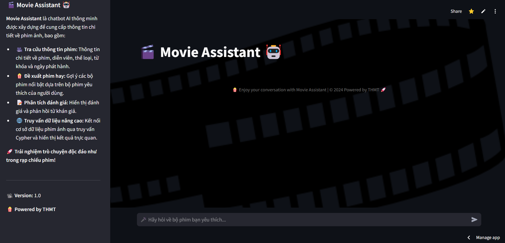
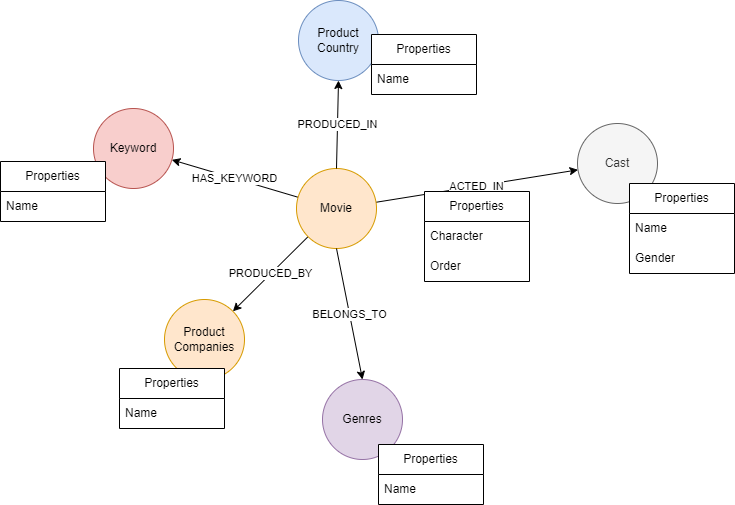

# 🎬 MovieBot - A Chatbot for Movie Enthusiasts  

MovieBot is an interactive chatbot designed to help you explore the world of cinema. With smart features, MovieBot can answer your questions about movies, actors, characters, and more!  

## 🚀 Features  

- **Movie Information**  
   - Ask about movie summaries, release dates, genres, directors, and more.  
   - Eng Example: "Tell me about the movie *Inception*."  
   - Vi Example: "Thông tin về phim *Inception*."

- **Actor Details**  
   - Search for information about actors, including their names and the roles they have played in movies.
   - Eng Example: "Which movies has *Leonardo DiCaprio* starred in?"
   - Vi Example: "Những bộ phim có diễn viên *Leonardo DiCaprio* đóng?"

- **Character Q&A**  
   - Learn about characters in movies, their roles, and backstories.  
   - Eng Example: "Who is *Tony Stark* in Marvel movies?"
   - Vi Example: "Ai là *Tony Stark* trong phim Marvel movies?"

- **Personalized Movie Recommendations**  
   - Receive recommendations on what movie to watch next based on keywords and the user's favorite films.
   - Eng Example: "I’ve watched Inception, what should I watch next?"
   - Vi Example: "Tôi đã xem inception thì nên xem gì tiếp theo?"

- **Automatically correct misspelled**
    - Automatically correct misspelled movie titles, action name, keyword,... entered by users based on an existing list of available movies.
    - Eng Example: "when did the *iron main 2* release" -> Fixed -> "when did the *iron man 2* release"
    - Vi Example: "Phim *iron main 2* ra mắt vào thời gian nào?" -> "Phim *iron man 2* ra mắt vào thời gian nào?
  
- **Website**
    - [Link demo](https://blackk.streamlit.app/)
   

## 🛠️ Technologies  

- **Programming Language**: Python  , RAG (Retrieval-Augumented Generation)
- **Deploy**: Streamlit Community Cloud
- **Technology**: 
  - RAG for your private data
  - Knowledge Graph will improve accuracy
  - Use the Neo4j graph database and Cypher query
  - Integrate a recommendation system.
- **Data Sources**:  
   - TMDb API (The Movie Database) for movie information  
   - About 5000 movies
   - OpenAI GPT for natural language processing
- **Database schema**:
   

## 🔧 Installation  

1. **Clone the Repository**  
   ```bash  
   git clone https://github.com/Tohoangminhtien/RAG-Movie.git
   cd RAG-Movie

2. **Install dependencies**
    ```bash  
   pip install requirements.txt
3. **Run Streamlit script**
    ```bash  
   streamlit run app.py

## Author:
*To Hoang Minh Tien*